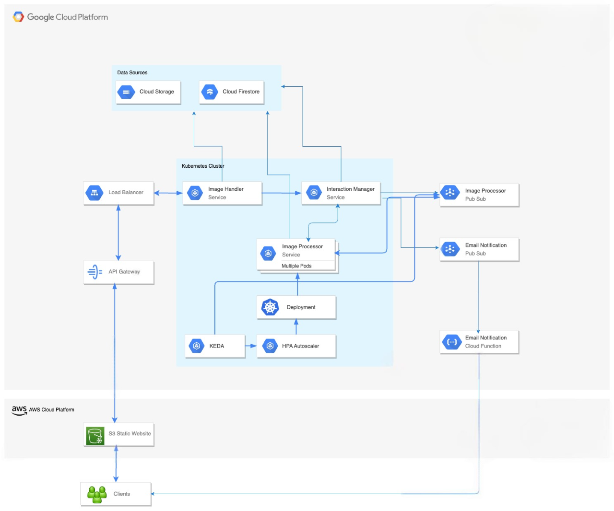

# ImageFlow: A Scalable Image Processing Application

ImageFlow is a cloud-native application designed to handle scalable image processing tasks efficiently. The system leverages modern technologies like Kubernetes, Google Cloud Platform (GCP), and React to provide a seamless user experience for uploading, modifying, and retrieving images.

## Team Members
1. **Sagar Swami Rao Kulkarni**
2. **Pavan Sai Appari**

## Table of Contents
- [Getting Started](#getting-started)
- [Frontend Setup](#frontend-deployment)
- [Backend Deployment](#backend-deployment)
- [System Architecture](#system-architecture)
- [Technologies Used](#technologies-used)

## Getting Started

This project consists of two main components:
1. **Frontend**: A React-based user interface for image uploads and retrievals
2. **Backend**: A combination of GCP services, including Cloud Storage, Cloud Functions, and Pub/Sub, along with containerized services orchestrated using Kubernetes. These components work together to process, store, and notify users about their images efficiently.

### Prerequisites

- [Node.js](https://nodejs.org/) installed on your machine
- [Docker](https://www.docker.com/) for containerization
- [kubectl](https://kubernetes.io/docs/tasks/tools/) for managing Kubernetes clusters
- Access to a GCP project using service account with Pub/Sub, Cloud Storage, and Firestore enabled


## Frontend Deployment

The frontend application is to be deployed on an AWS S3 bucket to serve as a static website. Follow the steps below to set up and deploy:

### Step 1: Build the Application

Navigate to the frontend directory:

```bash
cd frontend/image-processing-frontend
```

Run the following command to build the production-ready version of the app:

```bash
npm run build
```

This generates a `build/` directory containing the static files required for deployment.


### Step 2: Configure an S3 Bucket

1. **Create an S3 Bucket**
   - Go to the **AWS Management Console** and navigate to the **S3** service.
   - Click **Create Bucket** and configure the following settings:
     - **Bucket Name:** Choose a unique name (e.g., `imageflow-frontend`).
     - **Region:** Select your preferred AWS region.
     - **Public Access:** Allow public access (temporarily for testing).

2. **Enable Static Website Hosting**
   - Go to the **Properties** tab of the bucket.
   - Under **Static Website Hosting**, select **Enable**.
   - Set the **Index Document** to `index.html`.
   - Set the **Error Document** to `index.html`.

### Step 3: Upload Files to S3

1. **Upload the Build Files**
   - Navigate to the **build/** directory in your project.
   - Use the AWS S3 Console to upload files.

2. **Set Permissions**
   - Ensure the files in the bucket are publicly accessible.
   - Configure an **S3 Bucket Policy** to allow public read access for static content.


## Backend Deployment

Navigate to the backend directory and deploy the backend services on GCloud Kubernetes cluster (e.g., Google Kubernetes Engine). Follow these steps to configure the necessary Google Cloud Run Functions,  Pub/Sub topics and subscriptions:

### Step 1: Set Up Google Cloud Pub/Sub Topics

1. **Create Topics**
   - Navigate to the **Pub/Sub** section in the Google Cloud Console.
   - Create two topics:
     - **Image Processing Queue Topic** (e.g., `image-processing-queue`).
     - **Email Notification Topic** (e.g., `email-notification-pub-sub`).

2. **Enable Settings**
   - **Message Retention:** Enable message retention.
   - **Encryption:** Select **Google-managed encryption key**.


### Step 2: Configure Subscriptions

#### **Subscription for Image Processing Queue**
Create a subscription for the `image-processing-queue` topic with the following settings:
   - **Delivery Type:** Pull
   - **Subscription Expiration:** Expires in 31 days if there is no activity.
   - **Acknowledgement Deadline:** 60 seconds
   - **Subscription Filter:** None
   - **Subscription Message Retention Duration:** 1 day
   - **Topic Message Retention Duration:** 7 days
   - **Retain Acknowledged Messages:** No
   - **Exactly Once Delivery:** Enabled
   - **Message Ordering:** Disabled
   - **Dead Lettering:** Enabled
   - **Retry Policy:** Retry after exponential backoff delay.
     - **Minimum Backoff Duration:** 30 seconds
     - **Maximum Backoff Duration:** 60 seconds

#### **Subscription for Email Notifications**
Create a subscription for the `email-notification-pub-sub` topic with the following settings:
   - **Delivery Type:** Push
   - **Push Endpoint:** Specify the **Cloud Run Function Endpoint** for the email notification system.
   - **Push Authentication:** Enabled
   - **Push Payload Unwrapping:** Disabled
   - **Subscription Expiration:** Will never expire.
   - **Acknowledgement Deadline:** 600 seconds
   - **Subscription Filter:** None
   - **Subscription Message Retention Duration:** 1 day
   - **Topic Message Retention Duration:** 7 days
   - **Retain Acknowledged Messages:** No
   - **Exactly Once Delivery:** Enabled
   - **Message Ordering:** Disabled
   - **Dead Lettering:** Enabled
   - **Retry Policy:** Retry after exponential backoff delay.
     - **Minimum Backoff Duration:** 10 seconds
     - **Maximum Backoff Duration:** 600 seconds


### Step 3: Deploy the Email Notification Cloud Function

1. **Create a New Cloud Function**
   - Click on **Create Function**in Google Cloud Console's Cloud Functions Page.
   - Configure the function as follows:
     - **Function Name:** `email-notification`
     - **Region:** Select the appropriate region for your application.
     - **Trigger Type:** Pub/Sub
     - **Topic:** Select the `email-notification` topic.
     - **Authentication:** Ensure **Trigger Authentication** is enabled.

2. **Upload Code**
   - Navigate to the `backend/EmailNotification` directory in your project.
   - Compress its contents into a `.zip` file:
     ```bash
     cd backend/EmailNotification
     zip -r email-notification.zip .
     ```
   - Upload the `.zip` file in the **Source Code** section of the Cloud Function deployment page.

3. **Set Runtime Environment**
   - Select the runtime that matches your programming language (e.g., **Python 3.9**).

4. **Configure Memory and Timeout**
   - Allocate sufficient memory of 256 MB.
   - Set an appropriate timeout of 120 seconds.

5. **Deploy the Cloud Function**
   - Click **Deploy** to deploy your Cloud Function.
 
### Step 4: Deploy Kubernetes Pods

From the backend folder, run the Kubernetes deployment script to configure the services and initialize your environment:

```bash
 ./scripts.sh
```

This script sets up the required pods and services, including the **Image Handler Pod**, **Interaction Manager Pod**, and **Image Processor Pod**, to interact with the configured Pub/Sub topics and Cloud Storage buckets.


## System Architecture

The architecture consists of two primary APIs: POST for image uploads and GET for retrieving processed images. Here's a detailed breakdown of each component:

1. **Image Handler Pod**
    - Manages image uploads and interactions with Google Cloud Storage
    - Stores uploaded images in UUID/input folders
    - Generates unique identifiers (UUID) for each upload
    - Communicates with Interaction Pod for further processing

2. **Interaction Manager Pod**
    - Handles service-to-service interactions and queue management
    - Retrieves image details from specified folders
    - Pushes data to Google Cloud Pub/Sub for processing
    - Manages processed image updates
    - Triggers email notifications through Email Notification Pub/Sub

3. **Image Processor Pod**
    - Processes images based on user requirements
    - Listens to Pub/Sub messages
    - Retrieves images from Cloud Storage
    - Stores processed images in UUID/output folders
    - Notifies Interaction Pod upon completion

4. **Image Processing Pub/Sub**
    - Queues batch-uploaded images for processing
    - Implements timeout mechanism to prevent duplicate processing
    - Manages message distribution to processor pods

5. **Email Notification Pub/Sub**
    - Receives completion notifications from Interaction Pod
    - Triggers Email Notification Cloud Function
    - Manages email notification queue

6. **Email Notification Cloud Function**
    - Triggered by Email Notification Pub/Sub
    - Sends email notifications to users
    - Includes UUID-based access links for processed images

7. **Dynamic Scaling**
    - Utilizes KEDA (Kubernetes Event-driven Autoscaling)
    - Scales Image Processor Pods based on Pub/Sub message volume
    - Optimizes resource utilization
    - Ensures efficient handling of varying workloads

## Technologies Used

### Software Components

* **Cloud Platforms**
    * Google Cloud Platform (GCP)
    * Amazon Web Services (AWS)

* **Storage Solutions**
    * Google Cloud Storage: Image storage (input/output)
    * AWS S3: Static website hosting

* **Messaging and Database**
    * Google Cloud Pub/Sub: Asynchronous component communication
    * Cloud Firestore: Metadata storage

* **Container Orchestration**
    * Kubernetes: Microservices management
    * KEDA: Event-driven autoscaling

* **Serverless**
    * Google Cloud Functions: Email notification handling

* **Backend Framework**
    * Flask: API endpoint implementation

* **Frontend Framework**
    * React: User interface development

